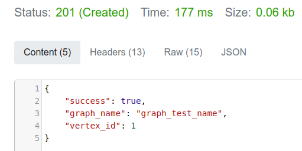
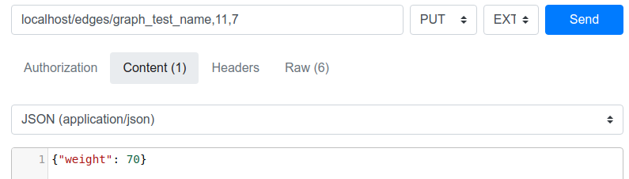

# Задание: Поиск кратчайшего пути в графе.

## Тестовое задание выполнил

Сибиряков Виктор  
Почта: dcrulez9601@gmail.com  
Telegram: +7(939)303-38-40

## Конфигурация

* В корне проекта выполнить ```composer install```.
* Указать в config/db.php корректные данные для авторизации в базе данных (в разработке использовалась СУБД PostgreSQL).
* Восстановить базу данных со схемами с помощью файла 'db_copy.sql' (копия делалась способом, описанным здесь: https://nicolaswidart.com/blog/duplicate-a-postgresql-schema, можно восстановить как написано там же в разделе 3, или просто набрать в терминале в корне директории ```psql -U username -d database_name -f db_copy.sql```).  
ИЛИ  
Создать в желаемой базе данных требуемые таблицы, выполнив следующие команды:
* * Таблица graph для хранения графов:
```
CREATE TABLE public.graph (
    name character varying(20) NOT NULL,
    CONSTRAINT name_length CHECK ((char_length((name)::text) >= 6))
);

ALTER TABLE ONLY public.graph
    ADD CONSTRAINT graph_pkey PRIMARY KEY (name);
```
* * Таблица vertex для хранения вершин:
```
CREATE TABLE public.vertex (
    graph_name character varying(20) NOT NULL,
    id smallint NOT NULL,
    CONSTRAINT positive_id CHECK ((id > 0))
);

ALTER TABLE ONLY public.vertex
    ADD CONSTRAINT vertex_pkey PRIMARY KEY (graph_name, id);
    
ALTER TABLE ONLY public.vertex
    ADD CONSTRAINT vertex_graph_name_fkey FOREIGN KEY (graph_name) REFERENCES public.graph(name) ON DELETE CASCADE;
```
* * Таблица edge для хранения рёбер:  
```
CREATE TABLE public.edge (
    graph_name character varying(20) NOT NULL,
    start_vertex_id smallint NOT NULL,
    end_vertex_id smallint NOT NULL,
    weight integer NOT NULL,
    CONSTRAINT positive_end_id CHECK ((end_vertex_id > 0)),
    CONSTRAINT positive_start_id CHECK ((start_vertex_id > 0)),
    CONSTRAINT positive_weight CHECK ((weight > 0))
);

ALTER TABLE ONLY public.edge
    ADD CONSTRAINT edge_pkey PRIMARY KEY (graph_name, start_vertex_id, end_vertex_id);
    
ALTER TABLE ONLY public.edge
    ADD CONSTRAINT edge_graph_name_fkey FOREIGN KEY (graph_name, start_vertex_id) REFERENCES public.vertex(graph_name, id) ON DELETE CASCADE;
    
ALTER TABLE ONLY public.edge
    ADD CONSTRAINT edge_graph_name_fkey1 FOREIGN KEY (graph_name, end_vertex_id) REFERENCES public.vertex(graph_name, id) ON DELETE CASCADE;
```

* Указать корневой директорией веб-сервера директорию 'web' данного проекта.

## Первая часть: REST API

### Требования к идентификаторам

* 'имя_графа': последовательность из символов 'a-z', 'A-Z', '0-9', '\_' длиной не менее 6 и не более 20 символов;
* 'идентификатор_вершины': положительное число не более 32767;
* 'вес_ребра': положительное число не более 2147483647;

### Пример работы

Для тестирования работы разработанного API использовался сервис https://reqbin.com

#### Создание графа

Отправить HTTP-запрос с методом POST на _localhost/graphs_, содержащий JSON с следующими полями 
* 'name': имя графа. 

Пример:


Результат:


#### Удаление графа

Отправить HTTP_запрос с методом DELETE на _localhost/graphs/'имя_графа'

Пример:


Результат:


#### Добавление вершин

Отправить HTTP-запрос с методом POST на _localhost/vertices_, содержащий JSON с следующими полями: 
* 'graph_name': имя графа,
* 'id': идентификатор вершины.

Пример:


Результат:



#### Удаление вершин

Отправить HTTP_запрос с методом DELETE на _localhost/vertices/'имя_графа','идентификатор_вершины'

Пример:


Результат:


#### Добавление ребер

Отправить HTTP-запрос с методом POST на _localhost/edges_, содержащий JSON с следующими полями: 
* 'graph_name': имя графа, 
* 'start_vertex_id': идентификатор вершины, в которой начинается ребро,
* 'end_vertex_id': идентификатор вершины, в которой заканчивается ребро,
* 'weight': вес ребра.

Пример:


Результат:


#### Удаление ребер

Отправить HTTP_запрос с методом DELETE на _localhost/edges/'имя_графа','идентификатор_стартовой_вершины','идентификатор_конечной_вершины'_


Результат:


#### Изменение веса ребра

Отправить HTTP-запрос с методом PUT на _localhost/edges/'имя_графа','идентификатор_стартовой_вершины','идентификатор_конечной_вершины'_, содержащий JSON с следующими полями:
* 'weight': вес ребра.

Пример:



Результат:


#### Поиск кратчайшего пути

Отправить HTTP-запрос с методом GET на _localhost/graphs/'имя_графа'/shortest_path/'идентификатор_стартовой_вершины','идентификатор_конечной_вершины'_ 


Пример успешного результат:


Пример результата, когда искомого пути по графу не существует:


## Вторая часть: API для совместного редактирования

Прием изменений из одного браузера и отображение их в другом браузере (realtime).

### Запуск
* В терминале в корне проекта выполнить: ```php yii graph/start```.
* Открыть в браузере главную страницу (для локального хоста открыть ```http://localhost/```)

### Пример


Для проверки можно открыть эту же страницу в другом браузере и запросить, например, списки вершин и рёбер графа (кнопки Show Vertices и Show Edges), после чего в одном из браузеров создать/удалить вершину или ребро этого же графа. Изменения будут отображены в том браузере, в котором открыты списки, в реальном времени (без "ручного" обновления страницы).
